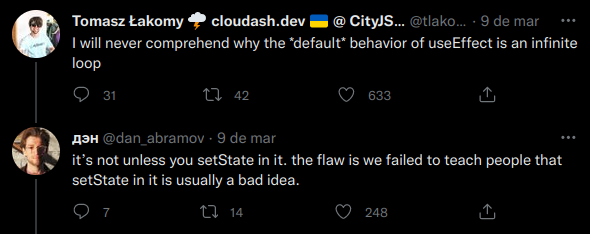
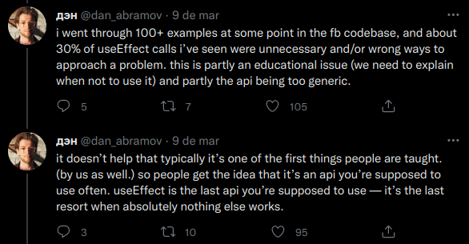
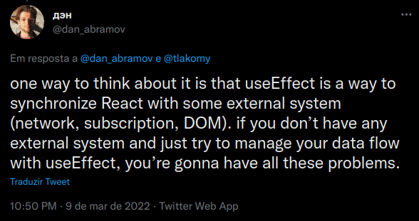

# [useEffect-once](https://use-effect-once.vercel.app/)

  
  

    
Click to see more tweets

    
    
  

 

## With React 18, React came with a controversial system to expose that your code contains bug

React basically simulate in development-only what happens when the user
navigates away from your component and then comes back to it, thanks to Strict
Mode. Because of that, the hook useEffect will be running twice and it can cause
some issues.

We should remember that useEffect is supposed to be used for synchronization,
 so if the user does that situation where it opens the page, goes to another page 
and then go back to the previous page, it's gonna trigger double connection
(database, subscription, etc.) if you don't make some sort of disconnection.

In the <a href='https://www.youtube.com/watch?v=HPoC-k7Rxwo' target='_blank'>
David Khourshid's talk</a> at Reactathon 2022, 
<a href='https://github.com/davidkpiano' target='_blank'>David</a> tries to 
clarify it, and that effects should goes in event handlers. But, if you are 
trying to fetching an API inside useEffect, for example, without some state 
management library, you could avoid the double effect with a boolean Ref and 
updating with a cleanup function.

 

## Examples

### Inside `/src/pages` there's two use cases:

1. `NormalUsage.tsx` is a component page that fetch an API with the most common
   use case with useEffect, which causes double effect.
2. `Solution.tsx` is a component page that does the same fetch, but handles the
   component remounting.

 

## Try it

### Clone the repo

`git clone https://github.com/andreseichi/useEffect-once`

### Install all dependencies

`yarn`

### Start the server

`yarn dev`

### Check the console for every page

 

## [useEffect's section in beta doc](https://beta-reactjs-org-git-effects-fbopensource.vercel.app/learn/synchronizing-with-effects) (not done yet) being written by [Dan Abramov](https://github.com/gaearon)
